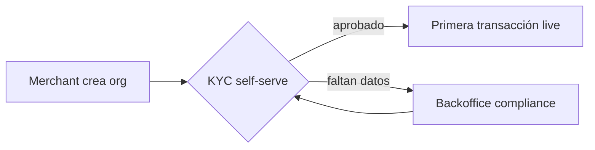

# Vault Guide: agents/

This Obsidian vault runs **product projects**. A project gathers research,
meeting notes, and decisions and produces a **deliverable** — most often a
product spec that gets mirrored into Notion. There are four project types:

| Type | For | Deliverable |
|---|---|---|
| **spec** | Spec planning for a feature (often tied to a Linear project) | `*-spec.md` → mirrored to Notion (**Product Spec Docs**) |
| **research** | General topic research, usually **not** tracked in Linear | `*-research.md` |
| **roadmap-review** | Monthly roadmap review meeting | `*-roadmap-review.md` (references the month's projects) |
| **strategy** | Quarterly strategic planning meeting | `*-strategy.md` (**Team Strategy Docs**) |

Code stays **outside** the vault (see repo handling in the workspace
[`../AGENTS.md`](../AGENTS.md)); reference it from `project.md` instead.

---

## Default working mode — every session is filed in a project

Substantive work should be **captured in a project**, so the vault stays the
single source of truth for what's being worked on and why. At the start of a
session:

1. Check `projects/` for an existing project the work belongs to — reuse it if
   one fits.
2. If none fits, scaffold a new project with the right `--type`
   (see [Starting a project](#starting-a-project)).
3. File the substantive output — research findings, decisions and their
   rationale, plans, meeting takeaways, and the deliverable — into that project
   as the work happens.

**Only what's worth keeping, distilled:**

- **Substantive only** — capture work with lasting value (a decision, a finding,
  a plan, a deliverable). Skip trivial or throwaway sessions (quick lookups,
  one-off commands). When in doubt, don't file it.
- **Distilled, not a transcript** — write the conclusion, the decision and why,
  the finding that matters — the way a colleague would want to find it later.
  Never paste the chat log or a blow-by-blow of the conversation.

Prefer reusing an existing project over creating near-duplicates; create a new
one only for a genuinely new thread of work. If it's ambiguous which project a
session belongs to, ask before creating one.

---

## Folder structure

```
agents/
  AGENTS.md              # this guide
  CLAUDE.md              # @AGENTS.md
  projects/
    YYYY-MM-<slug>/      # one folder per project
      project.md         # overview + master frontmatter
      <slug>-spec.md     # the deliverable (spec | research | roadmap-review | strategy)
      research/          # research notes, data pulls (BigQuery), repo findings
      meetings/          # meeting notes that feed this project
      decisions/         # product/scope decisions made during the project
      documents/         # images, PDFs, screenshots, references
  meetings/              # standalone meeting notes not yet tied to a project
  templates/             # note templates — copy and rename when creating notes
    project.md
    product-spec.md
    research.md
    meeting-notes.md
    decision.md
    plan.md
    roadmap-review.md
    strategy.md
  _archive/              # completed projects (same internal layout)
  scripts/
    new-project.sh       # scaffolds a project by --type
    new-meeting.sh       # scaffolds a meeting note (optionally into a project)
```

Subfolders vary by type: `spec` and `strategy` get `research/`; all get
`meetings/` and `documents/`; only `spec` gets `decisions/`. `new-project.sh`
creates the right set automatically.

---

## File naming

**Never use generic names like `research.md` or `decision.md` inside a folder.**
The folder already conveys the type. The filename must call out the **subject**.

Use descriptive, kebab-case names:

```
research/shopify-onboarding-dropoff.md
research/card-processing-mcc-codes.md
meetings/2026-07-14-vambe-card-payments.md
decisions/single-mcc-code-for-launch.md
decisions/bambe-as-card-processor.md
documents/checkout-flow-mockup.png
documents/vambe-commercial-brief.pdf
```

The per-project deliverable is the exception — it is named after the project
(`<slug>-spec.md`) and lives at the project root.

---

## File metadata (YAML frontmatter)

Every note starts with a frontmatter block. Obsidian renders these as
Properties and makes them filterable/queryable. Templates ship with the right
fields — the key ones:

### Base fields (all note types)

```yaml
---
title: "Human-readable title"
type: project | spec | research | meeting | decision | plan | roadmap-review | strategy
status: <see per-type>
created: YYYY-MM-DD
updated: YYYY-MM-DD
tags: []
tickets: []           # Linear ticket IDs, e.g. [FIN-123]
related: []           # wikilinks, e.g. ["[[single-mcc-code-for-launch]]"]
---
```

### Per-type additions

**project.md** — `project_type` (spec | research | roadmap-review | strategy),
`owner`, `linear_project`, `notion_url`, `figma`, `repos` (referenced, not
cloned), `prototype_branch`.

**product-spec.md** — `author`, `linear_project`, `notion_url`, `figma`,
`strategy_doc`; `status: draft | in-review | approved | shipped`.

**meeting-notes.md** — `date`, `attendees`, `feeds` (wikilink to the project it
feeds), `source`; `status: captured | processed`.

**strategy.md** / **roadmap-review.md** — `quarter` (e.g. `Q3-2026`), `team`;
strategy adds `notion_url`, roadmap adds `owner` + `linear_roadmap`.

**decision.md** — `decided_on`, `supersedes`, `superseded_by`.

### `decisions/` — what goes here

Any product decision taken **while working**: a scope cut, a tradeoff accepted,
an approach chosen over another. The goal is that a future reader understands
*why* the spec is the way it is. Keep them lightweight: Context, Decision, Why.

---

## Connecting notes in Obsidian

### Internal links

| Syntax | Renders as |
|---|---|
| `[[note-name]]` | Link to a note by filename (no extension) |
| `[[note-name#Heading]]` | Link to a specific heading |
| `[[note-name\|label]]` | Link with a custom display label |

Always link by the descriptive filename. Obsidian resolves vault-wide by
filename; no path needed unless two notes share a name.

### Transclusion / embedding

| Syntax | Effect |
|---|---|
| `![[note-name]]` | Embed the full note inline |
| `![[note-name#Heading]]` | Embed a single section |
| `![[mockup.png]]` | Embed an image from `documents/` |
| `![[brief.pdf]]` | Embed a PDF viewer |

### Frontmatter `related` and `feeds`

Populate `related` with wikilinks to connected notes (feeds backlinks + graph
view). Meeting notes use `feeds:` to point at the project they inform, so a
roadmap review can pull in the month's meetings and specs.

### Ticket cross-referencing

Tag every note touching a Linear ticket with the ID in `tickets:`, then filter
in Obsidian search with `[tickets: FIN-123]`.

---

## Mermaid diagrams

Use fenced `mermaid` blocks anywhere for flows, sequences, and states. Obsidian
renders them natively — great for **Core UX Flows** in a spec.



Prefer a diagram whenever a flow is easier to grasp visually than in prose.

---

## Workflow

### Starting a project

```bash
# Spec (default) — tie it to Linear + prep the Notion mirror
bash scripts/new-project.sh manual-accreditation --type spec \
  --tickets FIN-123 --linear https://linear.app/... --notion https://notion.so/...

# Untracked research
bash scripts/new-project.sh cross-border-fees --type research

# Monthly roadmap review / quarterly strategy
bash scripts/new-project.sh onboarding-july --type roadmap-review
bash scripts/new-project.sh onboarding-q3 --type strategy
```

This creates `projects/YYYY-MM-<slug>/` with the right subfolders, a pre-filled
`project.md`, and the seeded deliverable (already linked from `project.md`).

### Capturing meetings

```bash
# Into a project (pre-links feeds:)
bash scripts/new-meeting.sh vambe-sync --project 2026-07-manual-accreditation
# Standalone (lands in agents/meetings/, link it into a project later)
bash scripts/new-meeting.sh discovery-call
```

Paste the Notion/Granola summary in; turn Action Items into Linear tickets or
into `decisions/` notes.

### During a project

- Add notes to the right subfolder; give them **subject** filenames.
- Keep `project.md` current — `status`, `tickets`, `repos`, `prototype_branch`.
- Draft the spec in the deliverable file; when it's shared, copy it into Notion
  and paste the URL into `notion_url`.
- Log product decisions as they happen (even small ones).

### Closing a project

1. Set `status: archived` in `project.md` (and `shipped`/`listo` on the deliverable).
2. Move the folder to `_archive/`:
   ```bash
   mv projects/YYYY-MM-<slug> _archive/
   ```
   Archived projects keep their structure and stay searchable.
