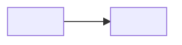

> [!info] Spec de producto
> Este es el entregable del proyecto. Escríbelo aquí, luego cópialo a Notion (base **Product Spec Docs**) y pega el link en `notion_url`.

## Problema

> [!tip]- 💡 Guía
> Explica el problema. Describe las oportunidades que se generan y el valor que le agregamos a nuestros clientes o usuarios. Explica **por qué** es un problema y **por qué** es importante para el negocio arreglarlo. Si tienes métricas, mejor.

## Objetivo

> [!tip]- 🎯 Guía
> Explica qué queremos lograr y qué valor esperamos agregarle a nuestro usuario/cliente.

### Métricas de éxito

> [!tip]- 🎖️ Guía
> ¿Cómo mediremos el éxito? Lista las métricas (si no existen, hay que agregarlas) y cómo las monitorearemos.

- *métrica 1*
- *métrica 2*

## Solución

> [!tip]- ⭐ Guía
> Describe la solución a nivel general y luego lista claramente qué features tiene, **desde el punto de vista del usuario**. Divide por superficie (API, Dashboard, Widget, MCP, Active Admin). Sé conciso; lo que no sea POV de usuario va en Anexos.

*Queremos construir…*

### Key Features: API

> [!tip]- 👨‍💻 Guía
> Escribe esta sección como si fuera la documentación pública de tu producto: POV del usuario, sin mencionar qué pasa por debajo. Contexto interno → Anexos.

#### Recurso *…*
***POST /v1/…***

*…*

**Webhooks**

*…*

**Errores y casos borde**

*…*

### Key Features: Dashboard

- *El usuario debe poder hacer X en la vista Y*

#### Permisos

> [!tip]- 🔑 Guía
> Define las nuevas acciones en el dashboard, propone nombres de policies y a qué roles se asignan por default. Actualiza la tabla de permisos en Notion al terminar el spec.

- …

#### Comunicación con clientes

> [!tip]- 📬 Guía
> Define los nuevos mails a clientes. Diseña el template con variables en tu proveedor de email y define destinatario. Actualiza la tabla en Notion al terminar.

- …

### Key Features: Checkout / Widget

- …

### Key Features: MCP

> [!tip]- 💡 Guía
> ¿Esta feature debe exponerse en el MCP? Cuestiónalo: no agregues tools "de yapa". Si la incluyes, define la(s) tool(s) y su objetivo desde el POV del agente; si no, déjalo explícito (out of scope para MCP).

- ¿Debe exponerse en el MCP? (sí / no, con justificación)
- Si sí: tool(s) a agregar y para qué sirven

### Key Features: Active Admin

- *Un usuario de AA debe poder hacer X en la vista Y*

#### Permisos de AA

- *Solo los usuarios con rol "ops" pueden …*

### Key Features: Analytics

> [!tip]- ⚠️ Guía
> Define bien el objetivo de los eventos. No agregues eventos por agregar: tienen que tener un objetivo de negocio claro (uso del feature, etc.).

- *Agregaremos el evento **`Y`** a Mixpanel con la siguiente información…*

## Scope

> [!tip]- 🙅 Guía
> Escribe claramente qué **no** construiremos. Esto es tan importante como Key Features. Escríbelo desde el POV del usuario.

## Core UX Flows

> [!tip]- 🖋️ Guía
> Si aplica, escribe o diagrama los flujos de interacción del usuario. No es el lugar para mockups perfectos: es para guiar el diseño después.

## Riesgos

> [!tip]- 🚨 Guía
> ¿Qué problema puede surgir y qué haremos si surge? Ej: necesitamos acceso a una cuenta sandbox de un proveedor externo para desarrollar.

## Shipping it

> [!tip]- 🚢 Guía
> ¿Qué hay que hacer para lanzar? Crea estos como issues de Linear y déjalos en el proyecto con responsable asignado.

### Pre-launch validations
- [ ] Validar que todo funciona → *issue de Linear*

### Deploy de cambios en SDKs
- [ ] SDK Python → *issue de Linear*
- [ ] SDK Node → *issue de Linear*

### Cambios a la documentación
- [ ] Actualizar secciones de docs afectadas → *issue de Linear*
- [ ] URL de docs nuevos: 

### Go-to-market
- [ ] Si el launch es Tier A o B, agregar al calendario de producto
- [ ] Changelog
- [ ] Comunicación a ventas (ej: checklist de integración)
- [ ] Comunicación a success

## Anexos

<!-- Contexto interno, detalles técnicos, links a investigaciones ([[...]]) y decisiones ([[...]]). -->
